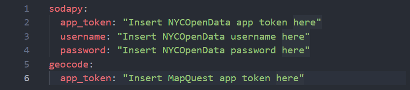
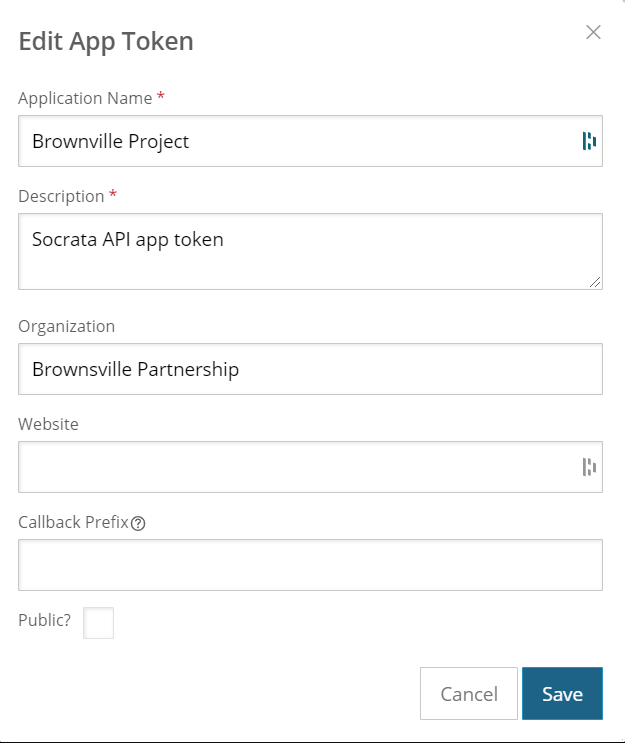
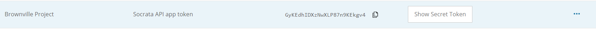
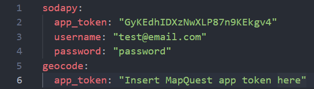
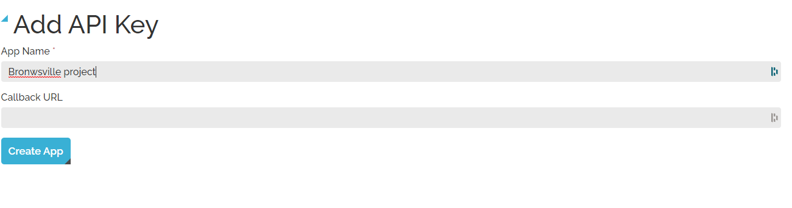
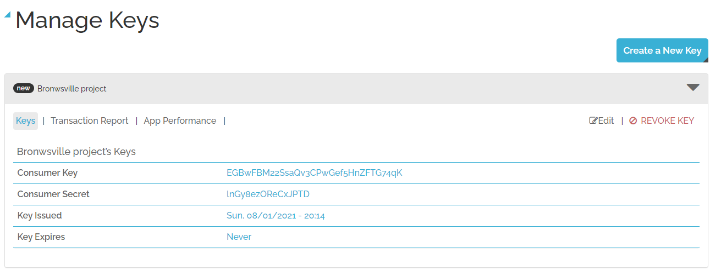
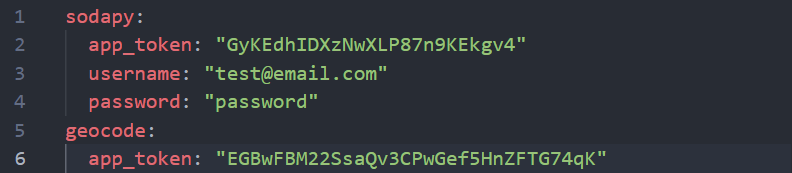

# Brownsville Project
The Brownsville project is a set of tools and codebooks that recompile, merges, filters, and transforms a set of datasets representing complaints over the Brownsville area.

# Overview
The Brownsville project includes the `Brownsville API`, a set of Python modules that ensure that the dataset is up to date. Furthermore, this API acts as an interface between the clean `brownsville.csv` dataset and the user. A current clean version of the dataset, along with analysis, can be found in the following locations of the repository:

- `data/brownsville/brownsville.csv` Cleaned dataset containing complaints from the Brownsville area, with building information attached
- `Brownsville API dataset analysis and visualizations.ipynb` Analysis of nature of complaints in the Brownsville area
- `building age and size analysis.ipynb` Analysis of building age/sizes and relationship to complaints
- `brownsville.html` Static version of the map displaying heatmap of complaints, and individual building summaries of complaints and typography

# Getting started
This section will guide you on how to get the project running. 

## Prerequisites
1. Git client
   - [Download the Git Client](Git)
2. Python 
   - [Download Python]()
   - [How to install Python](install-python)
3. Anaconda 
   - [Download Anaconda](Anaconda)
   - [Getting started with anaconda](getting-started-anaconda)
  
## Installation
1. Open the command prompt using  + R button and writing `cmd` in the run window. If you are using mac, open terminal.


2. Clone the repository by typing in the following command:
```
git clone https://github.com/alixlm19/Brownsville-project.git
```
3. Locate the cloned repository and copy its path. After this, paste the path to the command prompt/terminal using the following command:
```
cd path/to/cloned/repository
```
**Note:** on Windows, you can right click and select `Open in Windows Terminal` (Only works if terminal is already installed)

4. Install the Python dependencies typing in the command prompt/terminal the following command:
```
pip install -r requirements.txt
```

## Getting app tokens
This project requires a set of app tokens that ensure that the `Brownsville API` can communicate with some of the services required to function properly. To obtain the app tokens, follow these steps: 

1. Open the `config.yaml` file using any text editor. Once opened, the file should look like this: 

   

   **Important note:** do **NOT** change the spaces in the file; only change the text inside the double quoutes. Adding or deleting spaces outside of the quoutes can potentially prevent the `Brownsville API` from reading the file properly.

2. Visit the NYC Open Data website [here](nycopendata) and **sign up** for a new account. 
3. After the account is created, press `Edit Profile -> Developer Settings -> Create New App Token`. The following window should pop up:



Fill in the required fields as shown in the image. Leave the fields blank.
4. Press `save` and copy the created app token from the app token section. For example: 



5. Paste the app token to the `config.yaml` file, as well as the login information (email and password)



6. Visit the MapQuest website [here](mapquest) and **sign up** for a new account. 
7. After the account is created, press `Manage Keys -> Create a New Key`. The following window should pop up:



Press `Create App` after filling in the app name. 
8. After creating the app, you will be brought back to the `Manage Keys` site. Press the toggle button located to the right and copy the `Consumer Key`. 



9. Paste the `Consumer key` to the `config.yaml` file. It should end up looking something like this: 



10. Save the changes in the `config.yaml` file. 
# Documentation
The `Brownsville API` code documentation is located on the wiki section of the repository. To visit the wiki, press the wiki button on the top navigation bar of the repository or click [here](wiki).

# Acknowledgement
- [Folium-GroupedLayerControl](glc)
- [Windows 10 icon][windows 10]


[glc]:https://github.com/othneildrew/Best-README-Template#license

[Python]:https://www.python.org/downloads/
[install-python]:https://www.youtube.com/watch?v=xCixkaXrVMI

[Git]:https://git-scm.com/downloads
[install-git]:https://www.youtube.com/watch?v=xCixkaXrVMI

[Anaconda]:https://www.anaconda.com/products/individual#Downloads
[getting-started-anaconda]:https://docs.anaconda.com/anaconda/user-guide/getting-started/

[windows 10]: https://icon-icons.com/icon/windows-10-social-network/66166

[nycopendata]:https://data.cityofnewyork.us/signup

[mapquest]:https://developer.mapquest.com/plan_purchase/steps/business_edition/business_edition_free/register

[wiki]:https://github.com/alixlm19/Brownsville-project/wiki
